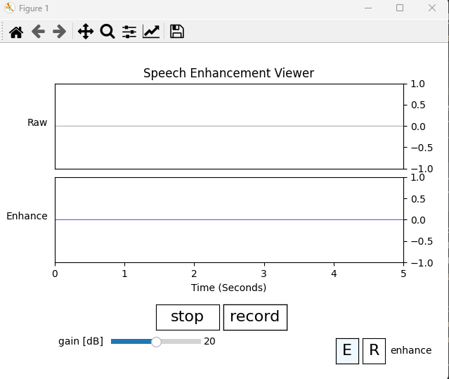

# Neural Network Speech Enhancement (NNSE)  

Neural Network Speech Enhancement (NNSE) is a speech enhancement (SE) model based on recurrent neural networks (RNN).  

**Update (04/02/2025):** 
1. Added support for the U-Net architecture.
2. Added TensorFlow Lite for Microcontrollers (TFLM) support.

## Directory contents
```py
nnse/ # root 
    evb/ # for evb deployment
        build/      # bin files
        includes/   # required inlcudes
        libs/       # required libs
        make/       # make.mk
        pack/
        src/        # c source codes
        Makfile
        autogen.mk
    python/   # for NN training
    README.md # this readme
```
## Prerequisite
### `Software`
To work on Apollo4, you need
- Arm GNU Toolchain 14.2
- Segger J-Link v7.56+
# Speech Enhancement
The speech enhancement models are based on 16 kHz sampling rate. The model sizes are about 100kB (simple RNN) and 170kB (U-Net).

### `Dataset`
The SE model is trained based on several audio dataset, including human speech and noises. Before you use this repo, please read on their license agreements carefully in [here](./docs/README.md).


## Compiling and Running a Pre-Trained Model  

There are two approaches for deploying a TensorFlow model to Ambiq microcontrollers:  

1. **TFLM (TensorFlow Lite for Microcontrollers)**  
   - Supports most neural network layers.  
   - Some 16x8-bit format layers, such as `separable conv` and `LSTM`, have limited support.  
   - To address these limitations, the `ns-tflm` library, available in `neuralSPOT`, provides additional support.  

2. **NS-NNSP (NeuralSPOT NNSP)**  
   - A lightweight, in-house solution optimized for efficiency.  
   - Supports only a limited set of layers: `conv1d`, `LSTM`, and `fully connected (FC)` layers.

### Using TFLM
To convert a model to TensorFlow Lite for Microcontrollers (TFLM) for Apollo 510 or Apollo 4, you can use neuralSPOT, an AI development toolkit provided by AmbiqAI.

We recommend downloading **neuralSPOT** in the same directory as **nnse**, maintaining the following directory structure:  

```sh
📂 target-directory/
   ├── 📂 nnse/
   ├── 📂 neuralSPOT/
```  

This setup ensures seamless integration and compatibility.

To clone the neuralSPOT repository, use the following commands:
```sh
cd <target-directory>
git clone https://github.com/AmbiqAI/neuralSPOT.git
```
Install the required libs for neuralSPOT in this commands:
```sh
cd neuralSPOT
python venv -m .venv
source .venv/bin/activate
pip install .
```
This setup ensures compatibility and ease of integration with nnse.

To generate a TensorFlow Lite (TFLite) model from a pre-trained model, follow these steps:
1. Navigate to the Python directory
    ```sh
    cd nnse/python
    ```
1. Define the TFLite filename
    ```sh
    tflite_filename=nnse_rnn_int16
    ```
1. Run the TFLite conversion script
    ```sh
    python c_code_table_converter.py --is_tflite True \
      --config_file nn_arch/config_se_nn_arch72_mel.yaml \
      --epoch_loaded 50 \
      --tflite_filename ./$tflite_filename.tflite
    ```
    This script converts the trained model to the TFLite one.
1. Convert the TFLite model to TensorFlow Lite for Microcontrollers (TFLM)
    ```sh
    ./tflm_autodeploy.sh $tflite_filename
    ```
    This script executes the conversion of the TFLite model to a format compatible with TFLM inside `nnse/evb/src/tflm`.
1. **Deployment**
    ```sh
    cd ../evb # go to `nnse/evb`
    make clean
    make model_folder=tflm
    make deploy
    make view # will provide SWO output as the device is running.
    ``` 
    Prepare two USB cables. Ensure your board is connected via both the `JLINK USB port` and the `audio USB port`. Then turn on the power on EVB.
1. Plug a mic into the 3.5mm port.

1. On your cmd, type
   ```sh
   python ../python/tools/audioview_se.py --tty /dev/tty.usbmodem1234561 # MacOS
   python ../python/tools/audioview_se.py --tty /dev/serial/by-id/usb-TinyUSB_TinyUSB_Device_123457-if00 # Ubuntu
   python ../python/tools/audioview_se.py --tty COM4 # Windows
   ```
   You should see a GUI popping out as below.
1. Press button 1 on EVB.\
    Click the `record` button to start the record. And click `stop` button to finish. The top panel will show the raw audio that microphone records, and the bottom one will show the enhanced audio.
    <p align="center">
      
    </p>

   - You might need to change the option `--tty` depending on your OS.
   - The option `playback=1` means you want to play the enhanced speech on the other computer via internet. One simple example is to use MS Teams (see [here](docs/demo.pdf)).
      - `Note`: we suggest to use earphone on the host side to avoid the echo effect. 
1. Check the two recording files under `nnse/evb/audio_result/`. 
   - `audio_raw.wav`: the raw PCM data from your mic.
   - `audio_se.wav`: the enhanced speech.

### Using NNSP
To generate the necessary files for NNSP, follow these steps:
1. Navigate to the Python directory and run the conversion script
    ```sh
    cd nnse/python
    python c_code_table_converter.py --is_tflite False \
    --config_file nn_arch/config_se_nn_arch72_mel.yaml \
    --epoch_loaded 50

    ```
1. Copy the generated source files to the target directory
    ```sh
    cp def_nn3_se.{c,h} ../evb/src/nnsp/
    ```
1. Navigate to the `evb` directory
    ```sh
    cd ../evb # go to nnse/evb
    ```
1. Clean and build the project
    ```sh
    make clean
    make model_folder=nnsp
    ```
The remaining steps are the same as in the TFLM case.

## Re-Training a New Model

Our approach to training the model can be found in [README.md](./python/README.md).

## NS-NNSP Library Overview  

The `ns-nnsp.a` library, currently part of NeuralSPOT, is a C library designed for building pipelines that include feature extraction and neural network processing on the Apollo4/Apollo5 platform. The source code is located in the directory [here](https://github.com/AmbiqAI/neuralSPOT/tree/main/neuralspot/ns-nnsp) and can be modified or rebuilt using [NeuralSPOT, Ambiq's AI Enablement Library](https://github.com/AmbiqAI/neuralSPOT).