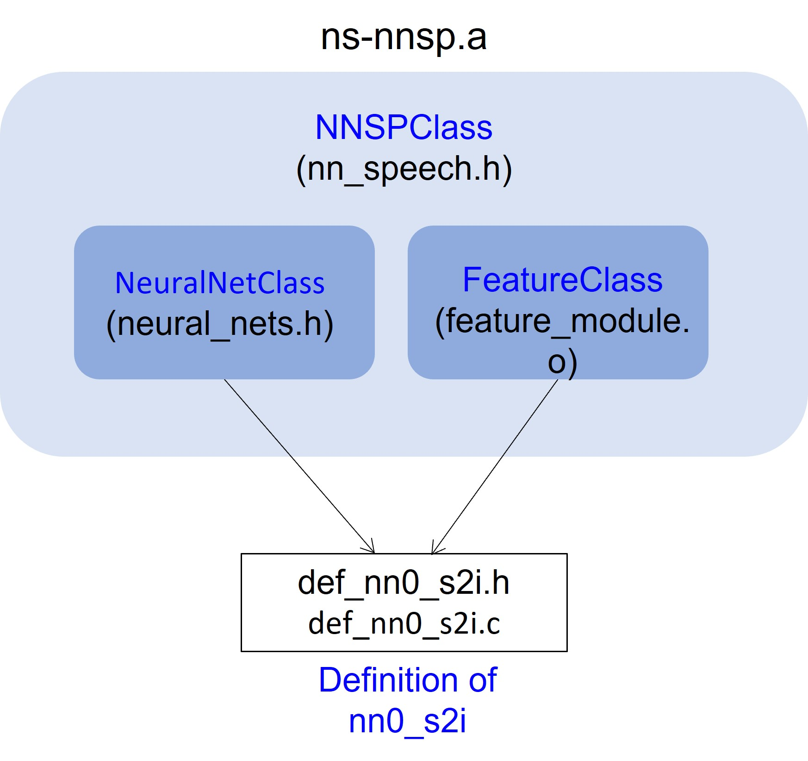

# NN Speech Enhancement
NN Speech Enhancement (NNSE) is a speech enhancement model (SE) based on recurrent neural networks (RNN).
## Directory contents
```py
nnse/ # root 
    evb/ # for evb deployment
        build/      # bin files
        includes/   # required inlcudes
        libs/       # required libs
        make/       # make.mk
        pack/
        src/        # c source codes
        Makfile
        autogen.mk
    ns-nnsp/  # c codes to build nnsp library (used only when re-building library)
    python/   # for NN training
    README.md # this readme
```
## Prerequisite
### `Software`
To work on Apollo4, you need
- Arm GNU Toolchain 11.3
- Segger J-Link v7.56+
# Speech Enhancement
This speech enhancement model is based on 16kHZ sampling rate. The model size is about 100kB.

### `Dataset`
The SE model is trained based on several audio dataset, including human speech and noises. Before you use this repo, please read on their license agreements carefully in [here](./docs/README.md).

## Compiling and Running a Pre-Trained Model
From the `nnse/evb/` directory:

1. `make clean`
2. `make`
3. `make deploy` Prepare two USB cables. Ensure your board is connected via both the `JLINK USB port` and the `audio USB port`. Then turn on the power on EVB.
4. Plug a mic into the 3.5mm port, and push BTN0 to initiate voice recording
5. `make view` will provide SWO output as the device is running, showing 
   predicted slots/intents etc.
6. On your cmd, type
   ```cmd
   $ python ../python/tools/audioview_se.py --tty=/dev/tty.usbmodem1234561
   ```
   You should see a GUI popping out.
   You might need to change the option `--tty` depending on your OS.
7. On your GUI, prress `record` to start recording and `stop` to stop recording. 
8. Check the two recording files under `nnse/evb/audio_result/`. 
   - `audio_raw.wav`: the raw PCM data from your mic.
   - `audio_se.wav`: the enhanced speech.

## Re-Training a New Model

Our approach to training the model can be found in [README.md](./python/README.md). The trained model is saved in [evb/src/def_nn3_se.c](evb/src/def_nn3_se.c) and [evb/src/def_nn3_se.h](evb/src/def_nn3_se.h). 

## Library NS-NNSP Library Overview
Library neuralspot NNSP, `ns-nnsp.a`, is a C library to build a pipeline including feature extraction and neural network to run on Apollo4. The source code is under the folder `ns-nnsp/`. You can modify or rebuild it via [NeuralSPOT Ambiq's AI Enablement Library](https://github.com/AmbiqAI/neuralSPOT).
In brief, there are two basic building blocks inside `ns-nnsp.a`, feature extraction and neural network. In `ns-nnsp.a`, we call them `FeatureClass` defined in `feature_module.h` and `NeuralNetClass` in `neural_nets.h`, respectively. Furthermore, `NNSPClass` in `nn_speech.h` encapsulates them to form a concrete instance.
We illustrate this in Fig. 1. 
<p align="center">
  
</p>
<p align="center">
  Fig. 1: Illustration of `ns-nnsp`
</p>

Also, in our specific s2i NN case, `def_nn0_s2i.c` has two purposes:
  1. For feature extraction, we use Mel spectrogram with 40 Mel-scale. To apply the standarization to the features in training dataset, it requires statistical mean and standard deviation, which is defined in `def_nn0_s2i.c`. 
  2. For the neural network, it points to the trained weight table defined in `def_nn0_s2i.c` as well.


# Build NS-NNSP library from NeuralSPOT (Optional)
If you want to modify or re-build the `ns-nnsp.a` library, you can follow the steps here. 
1. Download NeuralSPOT
```bash
$ git clone https://github.com/AmbiqAI/neuralSPOT.git ../neuralSPOT
```
2. Copy the source code of NS-NNSP to NeuralSPOT. Then go to NeuralSPOT folder.
```bash
$ cp -a ns-nnsp ../neuralSPOT/neuralspot; cd ../neuralSPOT
```
3. Open `neuralSPOT/Makefile` and append the `ns-nnsp` to the library modules as below
```bash
# NeuralSPOT Library Modules
modules      := neuralspot/ns-harness 
modules      += neuralspot/ns-peripherals 
modules      += neuralspot/ns-ipc
modules      += neuralspot/ns-audio
modules      += neuralspot/ns-usb
modules      += neuralspot/ns-utils
modules      += neuralspot/ns-rpc
modules      += neuralspot/ns-i2c
modules      += neuralspot/ns-nnsp # <---add this line

# External Component Modules
modules      += extern/AmbiqSuite/$(AS_VERSION)
modules      += extern/tensorflow/$(TF_VERSION)
modules      += extern/SEGGER_RTT/$(SR_VERSION)
modules      += extern/erpc/$(ERPC_VERSION)
```
4. Compile
```bash
$ make clean; make; make nest
```
5. Copy the necessary folders back to `nnsp` folder
```bash
$ cd nest; cp -a pack includes libs ../nnsp/evb
```